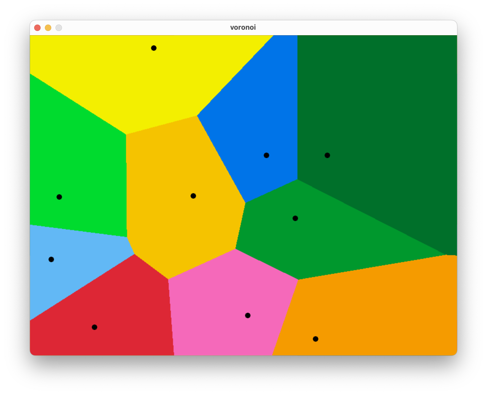

# Simple Voronoi in Raylib



## Building and Running
```
git clone git@github.com:felixfjh/voronoi-raylib.git 
cd voronoi-raylib/

"in ext/raylib/src/Makefile, set the RAYLIB_LIBTYPE to SHARED"
make all

./bin/voronoi
```

## Dependency
- [Raylib](https://github.com/raysan5/raylib)
